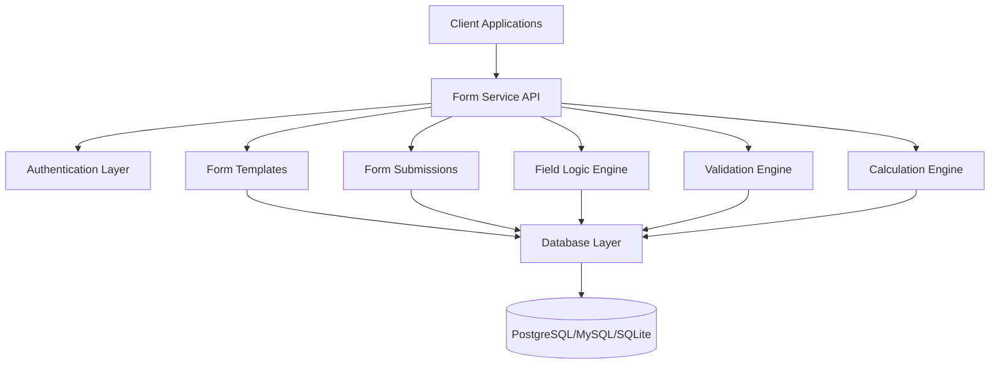

# Form Service Documentation

> A comprehensive Node.js microservice for dynamic form building, management, and processing with advanced skip logic and conditional field operations.

<div class="info">
  <strong>Latest Version:</strong> 1.0.0<br>
  <strong>Node.js Version:</strong> 18+<br>
  <strong>Database:</strong> PostgreSQL, MySQL, SQLite<br>
  <strong>License:</strong> MIT
</div>

## 🚀 Quick Start

Get up and running with Form Service in minutes:

```bash
# Clone the repository
git clone https://github.com/your-org/form-service.git
cd form-service

# Install dependencies
npm install

# Configure environment
cp config.local.json.example config.local.json
# Edit config.local.json with your settings

# Start the service
npm start
```

## 📚 Viewing Documentation

### Option 1: Through Form Service (Recommended)
```bash
# Start your form service
npm run dev

# Then open in browser:
# http://localhost:3000/api/docs
```

### Option 2: Standalone Documentation Server
```bash
# Start documentation server only
npm run docs

# Then open in browser:
# http://localhost:8080
```

### Option 3: Windows Users
```bash
# Double-click the batch file
serve-docs.bat
```

## ✨ Key Features

- **Dynamic Form Builder**: Create complex forms with conditional logic
- **Skip Logic Engine**: Advanced field visibility and skip conditions
- **Validation Rules**: Comprehensive field validation with custom rules
- **Calculation Logic**: Mathematical and logical operations on form fields
- **Field Operations**: Composition, iteration, and function expressions
- **RESTful API**: Complete CRUD operations for all entities
- **Multi-database Support**: PostgreSQL, MySQL, and SQLite
- **TypeScript**: Full type safety and IntelliSense support

## 🏗️ Architecture Overview



## 📚 Documentation Sections

### Getting Started
- [Quick Start Guide](about/quickstart.md) - Get up and running in 5 minutes
- [Installation](about/installation.md) - Detailed installation instructions
- [Configuration](about/configuration.md) - Environment and service configuration

### API Reference
- [REST API Overview](api/overview.md) - Complete API documentation
- [Authentication](api/authentication.md) - Security and authentication
- [Form Templates](api/form-templates.md) - Form template management
- [Form Fields](api/form-fields.md) - Field configuration and types
- [Form Submissions](api/form-submissions.md) - Data collection and processing

### Core Concepts
- [Skip Logic](guides/skip-logic.md) - Conditional field visibility
- [Validation Rules](guides/validation-rules.md) - Field validation
- [Calculation Logic](guides/calculation-logic.md) - Mathematical operations
- [Field Operations](guides/field-operations.md) - Advanced field manipulation

### Examples
- [Basic Form Creation](examples/basic-form.md) - Simple form example
- [Conditional Fields](examples/conditional-fields.md) - Skip logic examples
- [Validation Examples](examples/validation-examples.md) - Validation scenarios
- [API Integration](examples/api-integration-examples.md) - Client integration

## 🔧 API Endpoints

| Method | Endpoint | Description |
|--------|----------|-------------|
| `GET` | `/api/health` | Health check |
| `POST` | `/api/forms/templates` | Create form template |
| `GET` | `/api/forms/templates` | List form templates |
| `POST` | `/api/forms/submissions` | Submit form data |
| `GET` | `/api/forms/submissions` | Get form submissions |
| `POST` | `/api/fields/logic` | Create field logic |
| `POST` | `/api/fields/rules` | Create field rules |

## 🛠️ Development

### Prerequisites
- Node.js 18+
- PostgreSQL/MySQL/SQLite
- npm or yarn

### Local Development
```bash
# Install dependencies
npm install

# Run in development mode
npm run dev

# Run tests
npm test

# Build for production
npm run build
```

### Environment Variables
```bash
# Database Configuration
DB_HOST=localhost
DB_PORT=5432
DB_NAME=form_service
DB_USER=postgres
DB_PASSWORD=password

# Server Configuration
PORT=3000
NODE_ENV=development

# JWT Configuration
JWT_SECRET=your-secret-key
JWT_EXPIRES_IN=24h
```

## 🤝 Contributing

We welcome contributions! Please see our [Contributing Guide](about/contributing.md) for details.

## 📄 License

This project is licensed under the MIT License - see the [LICENSE](LICENSE) file for details.

## 🆘 Support

- **Documentation**: [docs.yourservice.com](https://docs.yourservice.com)
- **Issues**: [GitHub Issues](https://github.com/your-org/form-service/issues)
- **Discussions**: [GitHub Discussions](https://github.com/your-org/form-service/discussions)
- **Email**: support@yourservice.com

---

<div class="warning">
  <strong>Note:</strong> This documentation is for Form Service v1.0.0. For older versions, please check the [changelog](about/changelog.md).
</div> 