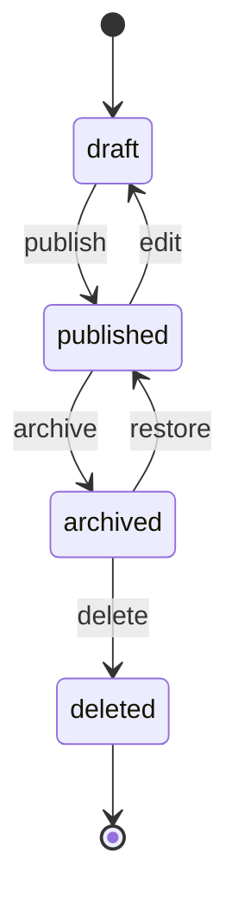

# Form Templates

> Complete API reference for form template management

## Overview

Form templates define the structure, fields, and logic of forms. They serve as reusable blueprints for creating forms with consistent layouts and behavior.

## Form Template Structure

```json
{
  "id": "template-uuid",
  "name": "Contact Form",
  "description": "A simple contact form for customer inquiries",
  "version": "1.0.0",
  "status": "published",
  "sections": [
    {
      "id": "section-uuid",
      "name": "Personal Information",
      "description": "Basic contact details",
      "order": 1,
      "fields": [
        {
          "id": "field-uuid",
          "name": "fullName",
          "label": "Full Name",
          "type": "text",
          "required": true,
          "order": 1,
          "validation": {
            "minLength": 2,
            "maxLength": 100
          }
        }
      ]
    }
  ],
  "createdBy": "user-uuid",
  "createdAt": "2024-01-15T10:30:00.000Z",
  "updatedAt": "2024-01-15T10:30:00.000Z"
}
```

## API Endpoints

### Create Form Template

<span class="api-method post">POST</span> `/api/forms/templates`

Create a new form template.

**Request Headers:**
```http
Authorization: Bearer <access-token>
Content-Type: application/json
```

**Request Body:**
```json
{
  "name": "Contact Form",
  "description": "A simple contact form for customer inquiries",
  "sections": [
    {
      "name": "Personal Information",
      "description": "Basic contact details",
      "order": 1,
      "fields": [
        {
          "name": "fullName",
          "label": "Full Name",
          "type": "text",
          "required": true,
          "order": 1,
          "placeholder": "Enter your full name",
          "validation": {
            "minLength": 2,
            "maxLength": 100
          }
        },
        {
          "name": "email",
          "label": "Email Address",
          "type": "email",
          "required": true,
          "order": 2,
          "placeholder": "Enter your email address",
          "validation": {
            "pattern": "^[a-zA-Z0-9._%+-]+@[a-zA-Z0-9.-]+\\.[a-zA-Z]{2,}$"
          }
        }
      ]
    }
  ]
}
```

**Response:**
```json
{
  "success": true,
  "data": {
    "id": "template-uuid-123",
    "name": "Contact Form",
    "description": "A simple contact form for customer inquiries",
    "version": "1.0.0",
    "status": "draft",
    "sections": [
      {
        "id": "section-uuid-1",
        "name": "Personal Information",
        "description": "Basic contact details",
        "order": 1,
        "fields": [
          {
            "id": "field-uuid-1",
            "name": "fullName",
            "label": "Full Name",
            "type": "text",
            "required": true,
            "order": 1,
            "placeholder": "Enter your full name",
            "validation": {
              "minLength": 2,
              "maxLength": 100
            }
          }
        ]
      }
    ],
    "createdBy": "user-uuid",
    "createdAt": "2024-01-15T10:30:00.000Z",
    "updatedAt": "2024-01-15T10:30:00.000Z"
  }
}
```

### Get Form Templates

<span class="api-method get">GET</span> `/api/forms/templates`

List all form templates with pagination and filtering.

**Request Headers:**
```http
Authorization: Bearer <access-token>
```

**Query Parameters:**
- `page` (number): Page number (default: 1)
- `limit` (number): Items per page (default: 10, max: 100)
- `search` (string): Search by name or description
- `status` (string): Filter by status (draft, published, archived)
- `createdBy` (string): Filter by creator
- `sortBy` (string): Sort field (name, createdAt, updatedAt)
- `sortOrder` (string): Sort order (asc, desc)

**Example Request:**
```bash
curl -X GET "http://localhost:3000/api/forms/templates?page=1&limit=10&status=published" \
  -H "Authorization: Bearer <access-token>"
```

**Response:**
```json
{
  "success": true,
  "data": {
    "items": [
      {
        "id": "template-uuid-123",
        "name": "Contact Form",
        "description": "A simple contact form for customer inquiries",
        "version": "1.0.0",
        "status": "published",
        "createdBy": "user-uuid",
        "createdAt": "2024-01-15T10:30:00.000Z",
        "updatedAt": "2024-01-15T10:30:00.000Z"
      }
    ],
    "pagination": {
      "page": 1,
      "limit": 10,
      "total": 25,
      "totalPages": 3,
      "hasNext": true,
      "hasPrev": false
    }
  }
}
```

### Get Form Template by ID

<span class="api-method get">GET</span> `/api/forms/templates/:id`

Get a specific form template by ID.

**Request Headers:**
```http
Authorization: Bearer <access-token>
```

**Path Parameters:**
- `id` (string): Template UUID

**Response:**
```json
{
  "success": true,
  "data": {
    "id": "template-uuid-123",
    "name": "Contact Form",
    "description": "A simple contact form for customer inquiries",
    "version": "1.0.0",
    "status": "published",
    "sections": [
      {
        "id": "section-uuid-1",
        "name": "Personal Information",
        "description": "Basic contact details",
        "order": 1,
        "fields": [
          {
            "id": "field-uuid-1",
            "name": "fullName",
            "label": "Full Name",
            "type": "text",
            "required": true,
            "order": 1,
            "placeholder": "Enter your full name",
            "validation": {
              "minLength": 2,
              "maxLength": 100
            }
          }
        ]
      }
    ],
    "createdBy": "user-uuid",
    "createdAt": "2024-01-15T10:30:00.000Z",
    "updatedAt": "2024-01-15T10:30:00.000Z"
  }
}
```

### Update Form Template

<span class="api-method put">PUT</span> `/api/forms/templates/:id`

Update an existing form template.

**Request Headers:**
```http
Authorization: Bearer <access-token>
Content-Type: application/json
```

**Path Parameters:**
- `id` (string): Template UUID

**Request Body:**
```json
{
  "name": "Updated Contact Form",
  "description": "An updated contact form with additional fields",
  "sections": [
    {
      "name": "Personal Information",
      "description": "Basic contact details",
      "order": 1,
      "fields": [
        {
          "name": "fullName",
          "label": "Full Name",
          "type": "text",
          "required": true,
          "order": 1
        },
        {
          "name": "phone",
          "label": "Phone Number",
          "type": "tel",
          "required": false,
          "order": 2
        }
      ]
    }
  ]
}
```

**Response:**
```json
{
  "success": true,
  "data": {
    "id": "template-uuid-123",
    "name": "Updated Contact Form",
    "description": "An updated contact form with additional fields",
    "version": "1.1.0",
    "status": "draft",
    "sections": [...],
    "updatedAt": "2024-01-15T11:30:00.000Z"
  }
}
```

### Delete Form Template

<span class="api-method delete">DELETE</span> `/api/forms/templates/:id`

Delete a form template.

**Request Headers:**
```http
Authorization: Bearer <access-token>
```

**Path Parameters:**
- `id` (string): Template UUID

**Response:**
```json
{
  "success": true,
  "message": "Form template deleted successfully"
}
```

### Publish Form Template

<span class="api-method post">POST</span> `/api/forms/templates/:id/publish`

Publish a draft form template.

**Request Headers:**
```http
Authorization: Bearer <access-token>
```

**Path Parameters:**
- `id` (string): Template UUID

**Response:**
```json
{
  "success": true,
  "data": {
    "id": "template-uuid-123",
    "status": "published",
    "publishedAt": "2024-01-15T12:00:00.000Z"
  }
}
```

### Archive Form Template

<span class="api-method post">POST</span> `/api/forms/templates/:id/archive`

Archive a published form template.

**Request Headers:**
```http
Authorization: Bearer <access-token>
```

**Path Parameters:**
- `id` (string): Template UUID

**Response:**
```json
{
  "success": true,
  "data": {
    "id": "template-uuid-123",
    "status": "archived",
    "archivedAt": "2024-01-15T12:00:00.000Z"
  }
}
```

### Duplicate Form Template

<span class="api-method post">POST</span> `/api/forms/templates/:id/duplicate`

Create a copy of an existing form template.

**Request Headers:**
```http
Authorization: Bearer <access-token>
Content-Type: application/json
```

**Path Parameters:**
- `id` (string): Template UUID

**Request Body:**
```json
{
  "name": "Contact Form - Copy",
  "description": "A copy of the original contact form"
}
```

**Response:**
```json
{
  "success": true,
  "data": {
    "id": "template-uuid-456",
    "name": "Contact Form - Copy",
    "description": "A copy of the original contact form",
    "version": "1.0.0",
    "status": "draft",
    "sections": [...],
    "createdAt": "2024-01-15T12:30:00.000Z"
  }
}
```

## Field Types

### Supported Field Types

| Type | Description | Validation Options |
|------|-------------|-------------------|
| `text` | Single line text input | minLength, maxLength, pattern |
| `textarea` | Multi-line text input | minLength, maxLength |
| `email` | Email address input | pattern (email validation) |
| `tel` | Telephone number input | pattern |
| `number` | Numeric input | min, max, step |
| `date` | Date picker | min, max |
| `datetime` | Date and time picker | min, max |
| `select` | Dropdown selection | options (array) |
| `radio` | Radio button group | options (array) |
| `checkbox` | Checkbox group | options (array) |
| `boolean` | Single checkbox | - |
| `file` | File upload | maxSize, allowedTypes |
| `hidden` | Hidden field | - |

### Field Configuration

```json
{
  "name": "fieldName",
  "label": "Field Label",
  "type": "text",
  "required": true,
  "order": 1,
  "placeholder": "Enter value",
  "defaultValue": "",
  "helpText": "Additional help text",
  "validation": {
    "minLength": 2,
    "maxLength": 100,
    "pattern": "^[a-zA-Z]+$",
    "customMessage": "Custom validation message"
  },
  "options": [
    {"value": "option1", "label": "Option 1"},
    {"value": "option2", "label": "Option 2"}
  ],
  "conditional": {
    "show": {
      "field": "otherField",
      "operator": "equals",
      "value": "show"
    }
  }
}
```

## Template Status

### Status Types

| Status | Description |
|--------|-------------|
| `draft` | Template is being edited |
| `published` | Template is live and can be used |
| `archived` | Template is no longer active |
| `deleted` | Template is marked for deletion |

### Status Transitions



## Template Versioning

### Version Management

- **Major Version**: Breaking changes (1.0.0 → 2.0.0)
- **Minor Version**: New features (1.0.0 → 1.1.0)
- **Patch Version**: Bug fixes (1.0.0 → 1.0.1)

### Version History

```json
{
  "versions": [
    {
      "version": "1.0.0",
      "status": "published",
      "createdAt": "2024-01-15T10:30:00.000Z",
      "createdBy": "user-uuid"
    },
    {
      "version": "1.1.0",
      "status": "draft",
      "createdAt": "2024-01-15T11:30:00.000Z",
      "createdBy": "user-uuid"
    }
  ]
}
```

## Template Categories

### Category Management

```json
{
  "categories": [
    {
      "id": "category-uuid",
      "name": "Contact Forms",
      "description": "Forms for collecting contact information"
    },
    {
      "id": "category-uuid-2",
      "name": "Surveys",
      "description": "Survey and feedback forms"
    }
  ]
}
```

### Assign Categories

<span class="api-method post">POST</span> `/api/forms/templates/:id/categories`

**Request Body:**
```json
{
  "categoryIds": ["category-uuid", "category-uuid-2"]
}
```

## Template Sharing

### Share Template

<span class="api-method post">POST</span> `/api/forms/templates/:id/share`

Share a template with other users or teams.

**Request Body:**
```json
{
  "users": ["user-uuid-1", "user-uuid-2"],
  "teams": ["team-uuid-1"],
  "permissions": ["read", "write"]
}
```

### Get Shared Templates

<span class="api-method get">GET</span> `/api/forms/templates/shared`

Get templates shared with the current user.

## Template Analytics

### Get Template Analytics

<span class="api-method get">GET</span> `/api/forms/templates/:id/analytics`

Get analytics for a specific template.

**Query Parameters:**
- `startDate` (string): Start date (ISO format)
- `endDate` (string): End date (ISO format)
- `metrics` (string): Comma-separated metrics

**Response:**
```json
{
  "success": true,
  "data": {
    "submissions": {
      "total": 150,
      "thisWeek": 25,
      "thisMonth": 100
    },
    "completionRate": 85.5,
    "averageTime": 180,
    "topFields": [
      {"field": "email", "completionRate": 95.2},
      {"field": "fullName", "completionRate": 92.1}
    ]
  }
}
```

## Error Responses

### Validation Errors

```json
{
  "success": false,
  "error": {
    "code": "VALIDATION_ERROR",
    "message": "Validation failed",
    "details": [
      {
        "field": "name",
        "message": "Name is required"
      },
      {
        "field": "sections",
        "message": "At least one section is required"
      }
    ]
  }
}
```

### Not Found Error

```json
{
  "success": false,
  "error": {
    "code": "NOT_FOUND",
    "message": "Form template not found",
    "details": "Template with ID 'template-uuid' does not exist"
  }
}
```

### Permission Error

```json
{
  "success": false,
  "error": {
    "code": "AUTHORIZATION_ERROR",
    "message": "Insufficient permissions",
    "details": "User does not have permission to update this template"
  }
}
```

## Best Practices

### Template Design

1. **Clear Structure**: Use logical sections and field ordering
2. **Descriptive Labels**: Use clear, user-friendly field labels
3. **Helpful Placeholders**: Provide examples in placeholders
4. **Appropriate Validation**: Set reasonable validation rules
5. **Mobile-Friendly**: Consider mobile device usage

### Performance

1. **Limit Field Count**: Keep forms under 50 fields for best performance
2. **Optimize Images**: Compress images in file upload fields
3. **Use Conditional Logic**: Show/hide fields based on user input
4. **Cache Templates**: Cache frequently accessed templates

### Security

1. **Validate Input**: Always validate user input
2. **Sanitize Data**: Clean data before storage
3. **Access Control**: Implement proper permissions
4. **Audit Trail**: Log template changes

## Next Steps

- 📝 [Form Fields](api/form-fields.md) - Field configuration details
- 🔗 [Skip Logic](guides/skip-logic.md) - Conditional field visibility
- ✅ [Validation Rules](guides/validation-rules.md) - Field validation
- 📊 [Form Submissions](api/form-submissions.md) - Data collection 