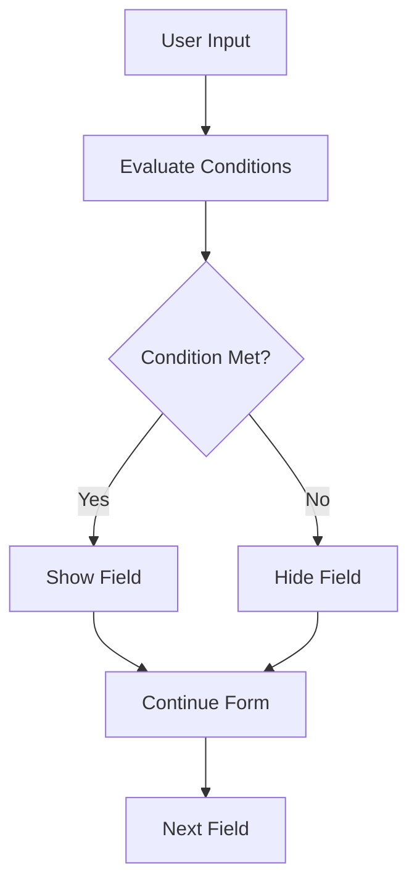

# Skip Logic Guide

> Complete guide to implementing conditional field visibility and skip logic in Form Service

## Overview

Skip logic allows you to show or hide form fields based on user responses to other fields. This creates dynamic, intelligent forms that adapt to user input in real-time.

## How Skip Logic Works

Skip logic evaluates conditions against form data and determines which fields should be visible or hidden. The logic is processed both on the client-side (for immediate feedback) and server-side (for validation).



## Skip Logic Structure

### Basic Condition Structure

```json
{
  "condition": {
    "field": "fieldName",
    "operator": "equals",
    "value": "expectedValue"
  },
  "action": "show",
  "description": "Show field when condition is met"
}
```

### Complex Condition Structure

```json
{
  "condition": {
    "operator": "and",
    "conditions": [
      {
        "field": "age",
        "operator": "greater_than",
        "value": 18
      },
      {
        "field": "country",
        "operator": "equals",
        "value": "US"
      }
    ]
  },
  "action": "hide",
  "description": "Hide field for US users over 18"
}
```

## Supported Operators

### Comparison Operators

| Operator | Description | Example |
|----------|-------------|---------|
| `equals` | Exact match | `"yes"` equals `"yes"` |
| `not_equals` | Not equal | `"no"` not equals `"yes"` |
| `contains` | Contains substring | `"hello world"` contains `"world"` |
| `not_contains` | Does not contain | `"hello"` not contains `"world"` |
| `starts_with` | Starts with | `"hello world"` starts with `"hello"` |
| `ends_with` | Ends with | `"hello world"` ends with `"world"` |
| `greater_than` | Numeric greater than | `25` greater than `18` |
| `less_than` | Numeric less than | `15` less than `18` |
| `greater_than_or_equal` | Numeric greater than or equal | `18` greater than or equal `18` |
| `less_than_or_equal` | Numeric less than or equal | `18` less than or equal `18` |
| `is_empty` | Field is empty or null | `""` is empty |
| `is_not_empty` | Field has value | `"hello"` is not empty |

### Logical Operators

| Operator | Description | Example |
|----------|-------------|---------|
| `and` | All conditions must be true | `condition1 AND condition2` |
| `or` | At least one condition must be true | `condition1 OR condition2` |
| `not` | Negate the condition | `NOT condition1` |

### Array Operators

| Operator | Description | Example |
|----------|-------------|---------|
| `in` | Value is in array | `"red"` in `["red", "blue", "green"]` |
| `not_in` | Value is not in array | `"yellow"` not in `["red", "blue", "green"]` |
| `all` | All values are in array | `["red", "blue"]` all in `["red", "blue", "green"]` |
| `any` | Any value is in array | `["red", "yellow"]` any in `["red", "blue", "green"]` |

## Field Types and Skip Logic

### Text Fields

```json
{
  "condition": {
    "field": "firstName",
    "operator": "is_not_empty",
    "value": null
  },
  "action": "show"
}
```

### Numeric Fields

```json
{
  "condition": {
    "field": "age",
    "operator": "greater_than",
    "value": 18
  },
  "action": "show"
}
```

### Select/Dropdown Fields

```json
{
  "condition": {
    "field": "country",
    "operator": "equals",
    "value": "US"
  },
  "action": "show"
}
```

### Radio Button Fields

```json
{
  "condition": {
    "field": "hasChildren",
    "operator": "equals",
    "value": "yes"
  },
  "action": "show"
}
```

### Checkbox Fields

```json
{
  "condition": {
    "field": "interests",
    "operator": "contains",
    "value": "technology"
  },
  "action": "show"
}
```

### Date Fields

```json
{
  "condition": {
    "field": "birthDate",
    "operator": "less_than",
    "value": "2000-01-01"
  },
  "action": "show"
}
```

## Skip Logic Actions

### Available Actions

| Action | Description |
|--------|-------------|
| `show` | Show the field when condition is met |
| `hide` | Hide the field when condition is met |
| `enable` | Enable the field when condition is met |
| `disable` | Disable the field when condition is met |
| `require` | Make field required when condition is met |
| `optional` | Make field optional when condition is met |

### Action Examples

```json
// Show field when condition is met
{
  "condition": {
    "field": "hasChildren",
    "operator": "equals",
    "value": "yes"
  },
  "action": "show"
}

// Hide field when condition is met
{
  "condition": {
    "field": "isStudent",
    "operator": "equals",
    "value": "no"
  },
  "action": "hide"
}

// Enable field when condition is met
{
  "condition": {
    "field": "hasAccount",
    "operator": "equals",
    "value": "yes"
  },
  "action": "enable"
}
```

## Complex Skip Logic Examples

### Multiple Conditions (AND)

```json
{
  "condition": {
    "operator": "and",
    "conditions": [
      {
        "field": "age",
        "operator": "greater_than",
        "value": 18
      },
      {
        "field": "country",
        "operator": "equals",
        "value": "US"
      },
      {
        "field": "hasLicense",
        "operator": "equals",
        "value": "yes"
      }
    ]
  },
  "action": "show"
}
```

### Multiple Conditions (OR)

```json
{
  "condition": {
    "operator": "or",
    "conditions": [
      {
        "field": "education",
        "operator": "equals",
        "value": "bachelor"
      },
      {
        "field": "education",
        "operator": "equals",
        "value": "master"
      },
      {
        "field": "education",
        "operator": "equals",
        "value": "phd"
      }
    ]
  },
  "action": "show"
}
```

### Nested Conditions

```json
{
  "condition": {
    "operator": "and",
    "conditions": [
      {
        "field": "age",
        "operator": "greater_than",
        "value": 18
      },
      {
        "operator": "or",
        "conditions": [
          {
            "field": "country",
            "operator": "equals",
            "value": "US"
          },
          {
            "field": "country",
            "operator": "equals",
            "value": "CA"
          }
        ]
      }
    ]
  },
  "action": "show"
}
```

### Conditional Calculations

```json
{
  "condition": {
    "operator": "and",
    "conditions": [
      {
        "field": "income",
        "operator": "greater_than",
        "value": 50000
      },
      {
        "field": "dependents",
        "operator": "greater_than",
        "value": 0
      }
    ]
  },
  "action": "show"
}
```

## Skip Logic API

### Create Skip Logic

<span class="api-method post">POST</span> `/api/field-logic/skip-logic`

**Request Body:**
```json
{
  "fieldId": "field-uuid",
  "condition": {
    "field": "hasChildren",
    "operator": "equals",
    "value": "yes"
  },
  "action": "show",
  "description": "Show children details when user has children"
}
```

**Response:**
```json
{
  "success": true,
  "data": {
    "id": "skip-logic-uuid",
    "fieldId": "field-uuid",
    "condition": {
      "field": "hasChildren",
      "operator": "equals",
      "value": "yes"
    },
    "action": "show",
    "description": "Show children details when user has children",
    "createdAt": "2024-01-15T10:30:00.000Z"
  }
}
```

### Get Skip Logic

<span class="api-method get">GET</span> `/api/field-logic/skip-logic/:fieldId`

**Response:**
```json
{
  "success": true,
  "data": [
    {
      "id": "skip-logic-uuid",
      "fieldId": "field-uuid",
      "condition": {
        "field": "hasChildren",
        "operator": "equals",
        "value": "yes"
      },
      "action": "show",
      "description": "Show children details when user has children",
      "createdAt": "2024-01-15T10:30:00.000Z"
    }
  ]
}
```

### Update Skip Logic

<span class="api-method put">PUT</span> `/api/field-logic/skip-logic/:id`

**Request Body:**
```json
{
  "condition": {
    "field": "hasChildren",
    "operator": "equals",
    "value": "yes"
  },
  "action": "show",
  "description": "Updated description"
}
```

### Delete Skip Logic

<span class="api-method delete">DELETE</span> `/api/field-logic/skip-logic/:id`

## Skip Logic Evaluation

### Client-Side Evaluation

```javascript
// Evaluate skip logic on client
function evaluateSkipLogic(formData, skipLogic) {
  const { condition, action } = skipLogic;
  
  // Evaluate the condition
  const conditionMet = evaluateCondition(condition, formData);
  
  // Apply the action
  if (action === 'show') {
    return conditionMet;
  } else if (action === 'hide') {
    return !conditionMet;
  }
  
  return true;
}

// Evaluate a condition
function evaluateCondition(condition, formData) {
  if (condition.operator === 'and') {
    return condition.conditions.every(c => evaluateCondition(c, formData));
  }
  
  if (condition.operator === 'or') {
    return condition.conditions.some(c => evaluateCondition(c, formData));
  }
  
  const fieldValue = formData[condition.field];
  const expectedValue = condition.value;
  
  switch (condition.operator) {
    case 'equals':
      return fieldValue === expectedValue;
    case 'not_equals':
      return fieldValue !== expectedValue;
    case 'contains':
      return fieldValue && fieldValue.includes(expectedValue);
    case 'greater_than':
      return Number(fieldValue) > Number(expectedValue);
    case 'less_than':
      return Number(fieldValue) < Number(expectedValue);
    case 'is_empty':
      return !fieldValue || fieldValue === '';
    case 'is_not_empty':
      return fieldValue && fieldValue !== '';
    default:
      return false;
  }
}
```

### Server-Side Evaluation

```typescript
// Server-side skip logic evaluation
class SkipLogicEvaluator {
  evaluate(formData: any, skipLogic: SkipLogic[]): FieldVisibility {
    const visibility: FieldVisibility = {};
    
    for (const logic of skipLogic) {
      const conditionMet = this.evaluateCondition(logic.condition, formData);
      const fieldId = logic.fieldId;
      
      if (logic.action === 'show') {
        visibility[fieldId] = conditionMet;
      } else if (logic.action === 'hide') {
        visibility[fieldId] = !conditionMet;
      }
    }
    
    return visibility;
  }
  
  private evaluateCondition(condition: Condition, formData: any): boolean {
    // Implementation similar to client-side
  }
}
```

## Best Practices

### 1. Keep Conditions Simple

**Good:**
```json
{
  "condition": {
    "field": "hasChildren",
    "operator": "equals",
    "value": "yes"
  }
}
```

**Avoid:**
```json
{
  "condition": {
    "operator": "and",
    "conditions": [
      {
        "operator": "or",
        "conditions": [
          {"field": "age", "operator": "greater_than", "value": 18},
          {"field": "hasParentalConsent", "operator": "equals", "value": "yes"}
        ]
      },
      {
        "operator": "not",
        "condition": {
          "field": "isIncarcerated",
          "operator": "equals",
          "value": "yes"
        }
      }
    ]
  }
}
```

### 2. Use Descriptive Field Names

**Good:**
```json
{
  "field": "hasChildren",
  "operator": "equals",
  "value": "yes"
}
```

**Avoid:**
```json
{
  "field": "q5",
  "operator": "equals",
  "value": "yes"
}
```

### 3. Test Skip Logic Thoroughly

```javascript
// Test skip logic with various scenarios
const testCases = [
  { hasChildren: 'yes', expected: true },
  { hasChildren: 'no', expected: false },
  { hasChildren: '', expected: false },
  { hasChildren: null, expected: false }
];

testCases.forEach(testCase => {
  const result = evaluateSkipLogic(testCase, skipLogic);
  console.assert(result === testCase.expected, 
    `Expected ${testCase.expected} for ${JSON.stringify(testCase)}`);
});
```

### 4. Consider Performance

- **Limit complex conditions**: Avoid deeply nested conditions
- **Cache evaluations**: Cache skip logic results when possible
- **Batch processing**: Process multiple skip logic rules together

### 5. Handle Edge Cases

```javascript
// Handle missing fields gracefully
function safeGetFieldValue(formData, fieldName) {
  return formData[fieldName] || null;
}

// Handle type mismatches
function compareValues(actual, expected, operator) {
  // Convert types appropriately
  if (operator === 'greater_than' || operator === 'less_than') {
    actual = Number(actual);
    expected = Number(expected);
  }
  
  return actual === expected;
}
```

## Common Patterns

### 1. Conditional Sections

Show/hide entire sections based on user responses:

```json
{
  "condition": {
    "field": "employmentStatus",
    "operator": "equals",
    "value": "employed"
  },
  "action": "show"
}
```

### 2. Progressive Disclosure

Reveal more fields as users provide information:

```json
{
  "condition": {
    "operator": "and",
    "conditions": [
      {
        "field": "hasAccount",
        "operator": "equals",
        "value": "yes"
      },
      {
        "field": "accountType",
        "operator": "is_not_empty"
      }
    ]
  },
  "action": "show"
}
```

### 3. Age-Based Logic

Show different fields based on age:

```json
{
  "condition": {
    "field": "age",
    "operator": "greater_than_or_equal",
    "value": 18
  },
  "action": "show"
}
```

### 4. Location-Based Logic

Show fields based on geographic location:

```json
{
  "condition": {
    "field": "country",
    "operator": "in",
    "value": ["US", "CA", "UK"]
  },
  "action": "show"
}
```

## Troubleshooting

### Common Issues

#### 1. Skip Logic Not Working

**Check:**
- Field names match exactly
- Data types are correct
- Conditions are properly formatted
- JavaScript errors in console

#### 2. Performance Issues

**Solutions:**
- Simplify complex conditions
- Cache skip logic results
- Batch evaluations
- Use efficient operators

#### 3. Inconsistent Behavior

**Check:**
- Client vs server evaluation differences
- Data type mismatches
- Field value formatting
- Timing issues

### Debug Mode

Enable debug logging for skip logic:

```javascript
// Enable debug mode
const DEBUG_SKIP_LOGIC = true;

function evaluateSkipLogic(formData, skipLogic) {
  if (DEBUG_SKIP_LOGIC) {
    console.log('Evaluating skip logic:', skipLogic);
    console.log('Form data:', formData);
  }
  
  // ... evaluation logic
  
  if (DEBUG_SKIP_LOGIC) {
    console.log('Result:', result);
  }
  
  return result;
}
```

## Next Steps

- ✅ [Validation Rules](guides/validation-rules.md) - Field validation
- 🧮 [Calculation Logic](guides/calculation-logic.md) - Mathematical operations
- 📝 [Form Fields](api/form-fields.md) - Field configuration
- 🔧 [API Reference](api/overview.md) - Complete API documentation 