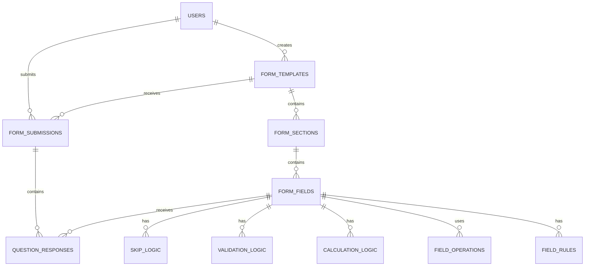

# Database Schema

> Complete database schema documentation for Form Service

## Overview

Form Service uses a relational database design with support for PostgreSQL, MySQL, and SQLite. The schema is designed to handle complex form structures, dynamic field logic, and scalable data storage.

## Database Architecture



## Core Tables

### Users Table

```sql
CREATE TABLE users (
  id UUID PRIMARY KEY DEFAULT gen_random_uuid(),
  email VARCHAR(255) UNIQUE NOT NULL,
  password_hash VARCHAR(255) NOT NULL,
  first_name VARCHAR(100),
  last_name VARCHAR(100),
  role VARCHAR(50) DEFAULT 'user',
  permissions JSONB DEFAULT '[]',
  is_active BOOLEAN DEFAULT true,
  email_verified BOOLEAN DEFAULT false,
  last_login_at TIMESTAMP,
  created_at TIMESTAMP DEFAULT CURRENT_TIMESTAMP,
  updated_at TIMESTAMP DEFAULT CURRENT_TIMESTAMP
);

-- Indexes
CREATE INDEX idx_users_email ON users(email);
CREATE INDEX idx_users_role ON users(role);
CREATE INDEX idx_users_active ON users(is_active);
```

### Form Templates Table

```sql
CREATE TABLE form_templates (
  id UUID PRIMARY KEY DEFAULT gen_random_uuid(),
  name VARCHAR(255) NOT NULL,
  description TEXT,
  version VARCHAR(20) DEFAULT '1.0.0',
  status VARCHAR(50) DEFAULT 'draft',
  created_by UUID REFERENCES users(id) ON DELETE SET NULL,
  created_at TIMESTAMP DEFAULT CURRENT_TIMESTAMP,
  updated_at TIMESTAMP DEFAULT CURRENT_TIMESTAMP
);

-- Indexes
CREATE INDEX idx_form_templates_created_by ON form_templates(created_by);
CREATE INDEX idx_form_templates_status ON form_templates(status);
CREATE INDEX idx_form_templates_created_at ON form_templates(created_at);
```

### Form Sections Table

```sql
CREATE TABLE form_sections (
  id UUID PRIMARY KEY DEFAULT gen_random_uuid(),
  template_id UUID REFERENCES form_templates(id) ON DELETE CASCADE,
  name VARCHAR(255) NOT NULL,
  description TEXT,
  order_index INTEGER NOT NULL,
  created_at TIMESTAMP DEFAULT CURRENT_TIMESTAMP
);

-- Indexes
CREATE INDEX idx_form_sections_template_id ON form_sections(template_id);
CREATE INDEX idx_form_sections_order ON form_sections(order_index);
```

### Form Fields Table

```sql
CREATE TABLE form_fields (
  id UUID PRIMARY KEY DEFAULT gen_random_uuid(),
  section_id UUID REFERENCES form_sections(id) ON DELETE CASCADE,
  name VARCHAR(255) NOT NULL,
  label VARCHAR(255) NOT NULL,
  type VARCHAR(50) NOT NULL,
  required BOOLEAN DEFAULT false,
  order_index INTEGER NOT NULL,
  placeholder TEXT,
  help_text TEXT,
  default_value TEXT,
  validation_rules JSONB,
  options JSONB,
  created_at TIMESTAMP DEFAULT CURRENT_TIMESTAMP
);

-- Indexes
CREATE INDEX idx_form_fields_section_id ON form_fields(section_id);
CREATE INDEX idx_form_fields_type ON form_fields(type);
CREATE INDEX idx_form_fields_order ON form_fields(order_index);
```

### Form Submissions Table

```sql
CREATE TABLE form_submissions (
  id UUID PRIMARY KEY DEFAULT gen_random_uuid(),
  template_id UUID REFERENCES form_templates(id) ON DELETE SET NULL,
  submitted_by UUID REFERENCES users(id) ON DELETE SET NULL,
  status VARCHAR(50) DEFAULT 'submitted',
  submitted_at TIMESTAMP DEFAULT CURRENT_TIMESTAMP,
  created_at TIMESTAMP DEFAULT CURRENT_TIMESTAMP
);

-- Indexes
CREATE INDEX idx_form_submissions_template_id ON form_submissions(template_id);
CREATE INDEX idx_form_submissions_submitted_by ON form_submissions(submitted_by);
CREATE INDEX idx_form_submissions_status ON form_submissions(status);
CREATE INDEX idx_form_submissions_submitted_at ON form_submissions(submitted_at);
```

### Question Responses Table

```sql
CREATE TABLE question_responses (
  id UUID PRIMARY KEY DEFAULT gen_random_uuid(),
  submission_id UUID REFERENCES form_submissions(id) ON DELETE CASCADE,
  field_id UUID REFERENCES form_fields(id) ON DELETE SET NULL,
  field_name VARCHAR(255) NOT NULL,
  value TEXT,
  created_at TIMESTAMP DEFAULT CURRENT_TIMESTAMP
);

-- Indexes
CREATE INDEX idx_question_responses_submission_id ON question_responses(submission_id);
CREATE INDEX idx_question_responses_field_id ON question_responses(field_id);
CREATE INDEX idx_question_responses_field_name ON question_responses(field_name);
```

## Field Logic Tables

### Skip Logic Table

```sql
CREATE TABLE skip_logic (
  id UUID PRIMARY KEY DEFAULT gen_random_uuid(),
  field_id UUID REFERENCES form_fields(id) ON DELETE CASCADE,
  condition JSONB NOT NULL,
  action VARCHAR(50) NOT NULL,
  description TEXT,
  created_at TIMESTAMP DEFAULT CURRENT_TIMESTAMP
);

-- Indexes
CREATE INDEX idx_skip_logic_field_id ON skip_logic(field_id);
CREATE INDEX idx_skip_logic_action ON skip_logic(action);
```

### Validation Logic Table

```sql
CREATE TABLE validation_logic (
  id UUID PRIMARY KEY DEFAULT gen_random_uuid(),
  field_id UUID REFERENCES form_fields(id) ON DELETE CASCADE,
  rule_type VARCHAR(50) NOT NULL,
  rule_config JSONB NOT NULL,
  error_message TEXT,
  created_at TIMESTAMP DEFAULT CURRENT_TIMESTAMP
);

-- Indexes
CREATE INDEX idx_validation_logic_field_id ON validation_logic(field_id);
CREATE INDEX idx_validation_logic_rule_type ON validation_logic(rule_type);
```

### Calculation Logic Table

```sql
CREATE TABLE calculation_logic (
  id UUID PRIMARY KEY DEFAULT gen_random_uuid(),
  field_id UUID REFERENCES form_fields(id) ON DELETE CASCADE,
  formula TEXT NOT NULL,
  dependencies JSONB,
  created_at TIMESTAMP DEFAULT CURRENT_TIMESTAMP
);

-- Indexes
CREATE INDEX idx_calculation_logic_field_id ON calculation_logic(field_id);
```

## Field Operations Tables

### Logical Operations Table

```sql
CREATE TABLE logical_operations (
  id UUID PRIMARY KEY DEFAULT gen_random_uuid(),
  field_id UUID REFERENCES form_fields(id) ON DELETE CASCADE,
  operation_type VARCHAR(50) NOT NULL,
  operands JSONB NOT NULL,
  result_type VARCHAR(50),
  created_at TIMESTAMP DEFAULT CURRENT_TIMESTAMP
);

-- Indexes
CREATE INDEX idx_logical_operations_field_id ON logical_operations(field_id);
CREATE INDEX idx_logical_operations_type ON logical_operations(operation_type);
```

### Mathematical Operations Table

```sql
CREATE TABLE mathematical_operations (
  id UUID PRIMARY KEY DEFAULT gen_random_uuid(),
  field_id UUID REFERENCES form_fields(id) ON DELETE CASCADE,
  operation_type VARCHAR(50) NOT NULL,
  operands JSONB NOT NULL,
  result_type VARCHAR(50),
  created_at TIMESTAMP DEFAULT CURRENT_TIMESTAMP
);

-- Indexes
CREATE INDEX idx_mathematical_operations_field_id ON mathematical_operations(field_id);
CREATE INDEX idx_mathematical_operations_type ON mathematical_operations(operation_type);
```

### Composition Operations Table

```sql
CREATE TABLE composition_operations (
  id UUID PRIMARY KEY DEFAULT gen_random_uuid(),
  field_id UUID REFERENCES form_fields(id) ON DELETE CASCADE,
  operation_type VARCHAR(50) NOT NULL,
  operands JSONB NOT NULL,
  result_type VARCHAR(50),
  created_at TIMESTAMP DEFAULT CURRENT_TIMESTAMP
);

-- Indexes
CREATE INDEX idx_composition_operations_field_id ON composition_operations(field_id);
CREATE INDEX idx_composition_operations_type ON composition_operations(operation_type);
```

## Field Rules Tables

### Skip Rules Table

```sql
CREATE TABLE skip_rules (
  id UUID PRIMARY KEY DEFAULT gen_random_uuid(),
  field_id UUID REFERENCES form_fields(id) ON DELETE CASCADE,
  rule_name VARCHAR(255) NOT NULL,
  rule_config JSONB NOT NULL,
  is_active BOOLEAN DEFAULT true,
  created_at TIMESTAMP DEFAULT CURRENT_TIMESTAMP
);

-- Indexes
CREATE INDEX idx_skip_rules_field_id ON skip_rules(field_id);
CREATE INDEX idx_skip_rules_active ON skip_rules(is_active);
```

### Validation Rules Table

```sql
CREATE TABLE validation_rules (
  id UUID PRIMARY KEY DEFAULT gen_random_uuid(),
  field_id UUID REFERENCES form_fields(id) ON DELETE CASCADE,
  rule_name VARCHAR(255) NOT NULL,
  rule_config JSONB NOT NULL,
  error_message TEXT,
  is_active BOOLEAN DEFAULT true,
  created_at TIMESTAMP DEFAULT CURRENT_TIMESTAMP
);

-- Indexes
CREATE INDEX idx_validation_rules_field_id ON validation_rules(field_id);
CREATE INDEX idx_validation_rules_active ON validation_rules(is_active);
```

### Calculation Rules Table

```sql
CREATE TABLE calculation_rules (
  id UUID PRIMARY KEY DEFAULT gen_random_uuid(),
  field_id UUID REFERENCES form_fields(id) ON DELETE CASCADE,
  rule_name VARCHAR(255) NOT NULL,
  rule_config JSONB NOT NULL,
  is_active BOOLEAN DEFAULT true,
  created_at TIMESTAMP DEFAULT CURRENT_TIMESTAMP
);

-- Indexes
CREATE INDEX idx_calculation_rules_field_id ON calculation_rules(field_id);
CREATE INDEX idx_calculation_rules_active ON calculation_rules(is_active);
```

## Additional Tables

### User Sessions Table

```sql
CREATE TABLE user_sessions (
  id UUID PRIMARY KEY DEFAULT gen_random_uuid(),
  user_id UUID REFERENCES users(id) ON DELETE CASCADE,
  token_hash VARCHAR(255) NOT NULL,
  refresh_token_hash VARCHAR(255),
  expires_at TIMESTAMP NOT NULL,
  created_at TIMESTAMP DEFAULT CURRENT_TIMESTAMP
);

-- Indexes
CREATE INDEX idx_user_sessions_user_id ON user_sessions(user_id);
CREATE INDEX idx_user_sessions_expires_at ON user_sessions(expires_at);
```

### API Keys Table

```sql
CREATE TABLE api_keys (
  id UUID PRIMARY KEY DEFAULT gen_random_uuid(),
  user_id UUID REFERENCES users(id) ON DELETE CASCADE,
  name VARCHAR(255) NOT NULL,
  key_hash VARCHAR(255) NOT NULL,
  permissions JSONB DEFAULT '[]',
  is_active BOOLEAN DEFAULT true,
  last_used_at TIMESTAMP,
  created_at TIMESTAMP DEFAULT CURRENT_TIMESTAMP
);

-- Indexes
CREATE INDEX idx_api_keys_user_id ON api_keys(user_id);
CREATE INDEX idx_api_keys_active ON api_keys(is_active);
```

### Audit Log Table

```sql
CREATE TABLE audit_log (
  id UUID PRIMARY KEY DEFAULT gen_random_uuid(),
  user_id UUID REFERENCES users(id) ON DELETE SET NULL,
  action VARCHAR(100) NOT NULL,
  resource_type VARCHAR(50) NOT NULL,
  resource_id UUID,
  details JSONB,
  ip_address INET,
  user_agent TEXT,
  created_at TIMESTAMP DEFAULT CURRENT_TIMESTAMP
);

-- Indexes
CREATE INDEX idx_audit_log_user_id ON audit_log(user_id);
CREATE INDEX idx_audit_log_action ON audit_log(action);
CREATE INDEX idx_audit_log_resource ON audit_log(resource_type, resource_id);
CREATE INDEX idx_audit_log_created_at ON audit_log(created_at);
```

## Data Types and Constraints

### JSONB Usage

The schema uses PostgreSQL's JSONB type for flexible data storage:

```sql
-- Example JSONB fields
validation_rules JSONB,  -- Field validation rules
options JSONB,           -- Field options (for select, radio, etc.)
permissions JSONB,       -- User permissions
condition JSONB,         -- Skip logic conditions
rule_config JSONB,       -- Rule configurations
```

### UUID Primary Keys

All tables use UUID primary keys for better distribution and security:

```sql
-- UUID generation
id UUID PRIMARY KEY DEFAULT gen_random_uuid()
```

### Timestamps

Consistent timestamp handling:

```sql
created_at TIMESTAMP DEFAULT CURRENT_TIMESTAMP,
updated_at TIMESTAMP DEFAULT CURRENT_TIMESTAMP
```

## Indexing Strategy

### Performance Indexes

```sql
-- Composite indexes for common queries
CREATE INDEX idx_form_submissions_template_status ON form_submissions(template_id, status);
CREATE INDEX idx_question_responses_submission_field ON question_responses(submission_id, field_name);
CREATE INDEX idx_form_fields_section_order ON form_fields(section_id, order_index);
```

### Full-Text Search Indexes

```sql
-- Full-text search on form templates
CREATE INDEX idx_form_templates_search ON form_templates USING gin(to_tsvector('english', name || ' ' || description));

-- Full-text search on question responses
CREATE INDEX idx_question_responses_search ON question_responses USING gin(to_tsvector('english', value));
```

## Database Migrations

### Migration Structure

```sql
-- Example migration file: 001_create_users_table.sql
BEGIN;

CREATE TABLE users (
  id UUID PRIMARY KEY DEFAULT gen_random_uuid(),
  email VARCHAR(255) UNIQUE NOT NULL,
  password_hash VARCHAR(255) NOT NULL,
  first_name VARCHAR(100),
  last_name VARCHAR(100),
  role VARCHAR(50) DEFAULT 'user',
  permissions JSONB DEFAULT '[]',
  is_active BOOLEAN DEFAULT true,
  email_verified BOOLEAN DEFAULT false,
  last_login_at TIMESTAMP,
  created_at TIMESTAMP DEFAULT CURRENT_TIMESTAMP,
  updated_at TIMESTAMP DEFAULT CURRENT_TIMESTAMP
);

CREATE INDEX idx_users_email ON users(email);
CREATE INDEX idx_users_role ON users(role);

COMMIT;
```

### Migration Commands

```bash
# Run migrations
npx prisma migrate deploy

# Create new migration
npx prisma migrate dev --name add_new_table

# Reset database
npx prisma migrate reset
```

## Database Configuration

### Connection Pooling

```typescript
// Database configuration
const dbConfig = {
  host: process.env.DB_HOST,
  port: parseInt(process.env.DB_PORT),
  database: process.env.DB_NAME,
  username: process.env.DB_USER,
  password: process.env.DB_PASSWORD,
  dialect: process.env.DB_DIALECT,
  pool: {
    min: 5,
    max: 20,
    acquire: 30000,
    idle: 10000
  }
};
```

### Environment Variables

```bash
# Database configuration
DB_HOST=localhost
DB_PORT=5432
DB_NAME=form_service
DB_USER=postgres
DB_PASSWORD=your_password
DB_DIALECT=postgres

# Connection pool settings
DB_POOL_MIN=5
DB_POOL_MAX=20
DB_POOL_ACQUIRE=30000
DB_POOL_IDLE=10000
```

## Backup and Recovery

### Backup Strategy

```bash
# PostgreSQL backup
pg_dump -h localhost -U postgres -d form_service > backup.sql

# MySQL backup
mysqldump -h localhost -u root -p form_service > backup.sql

# Automated backup script
#!/bin/bash
DATE=$(date +%Y%m%d_%H%M%S)
pg_dump -h localhost -U postgres -d form_service > backup_$DATE.sql
gzip backup_$DATE.sql
```

### Recovery Procedures

```bash
# PostgreSQL recovery
psql -h localhost -U postgres -d form_service < backup.sql

# MySQL recovery
mysql -h localhost -u root -p form_service < backup.sql
```

## Performance Optimization

### Query Optimization

```sql
-- Optimize slow queries
EXPLAIN ANALYZE SELECT * FROM form_submissions 
WHERE template_id = 'uuid' AND status = 'submitted';

-- Add covering indexes
CREATE INDEX idx_form_submissions_covering ON form_submissions(template_id, status, submitted_at) 
INCLUDE (id, submitted_by);
```

### Partitioning Strategy

```sql
-- Partition question_responses by date
CREATE TABLE question_responses_2024 PARTITION OF question_responses
FOR VALUES FROM ('2024-01-01') TO ('2025-01-01');

CREATE TABLE question_responses_2025 PARTITION OF question_responses
FOR VALUES FROM ('2025-01-01') TO ('2026-01-01');
```

## Security Considerations

### Data Encryption

```sql
-- Encrypt sensitive data
CREATE EXTENSION IF NOT EXISTS pgcrypto;

-- Encrypt API keys
UPDATE api_keys SET key_hash = crypt(key_hash, gen_salt('bf'));
```

### Access Control

```sql
-- Row-level security
ALTER TABLE form_submissions ENABLE ROW LEVEL SECURITY;

CREATE POLICY submission_access ON form_submissions
FOR ALL USING (submitted_by = current_user_id());
```

## Monitoring and Maintenance

### Database Monitoring

```sql
-- Monitor table sizes
SELECT 
  schemaname,
  tablename,
  attname,
  n_distinct,
  correlation
FROM pg_stats 
WHERE tablename = 'form_submissions';

-- Monitor index usage
SELECT 
  schemaname,
  tablename,
  indexname,
  idx_scan,
  idx_tup_read,
  idx_tup_fetch
FROM pg_stat_user_indexes;
```

### Maintenance Tasks

```sql
-- Regular maintenance
VACUUM ANALYZE form_submissions;
REINDEX TABLE form_submissions;

-- Update statistics
ANALYZE form_submissions;
```

## Next Steps

- 🏗️ [System Architecture](system-overview.md) - Overall system design
- 📊 [Domain Models](domain-models.md) - Business entity definitions
- 🔧 [API Reference](api/overview.md) - API documentation
- 🚀 [Deployment Guide](guides/deployment.md) - Production deployment 