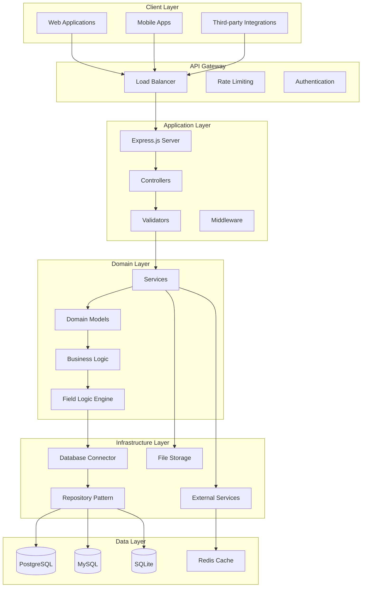
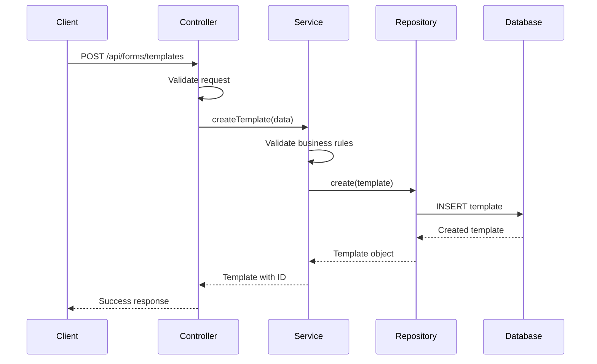
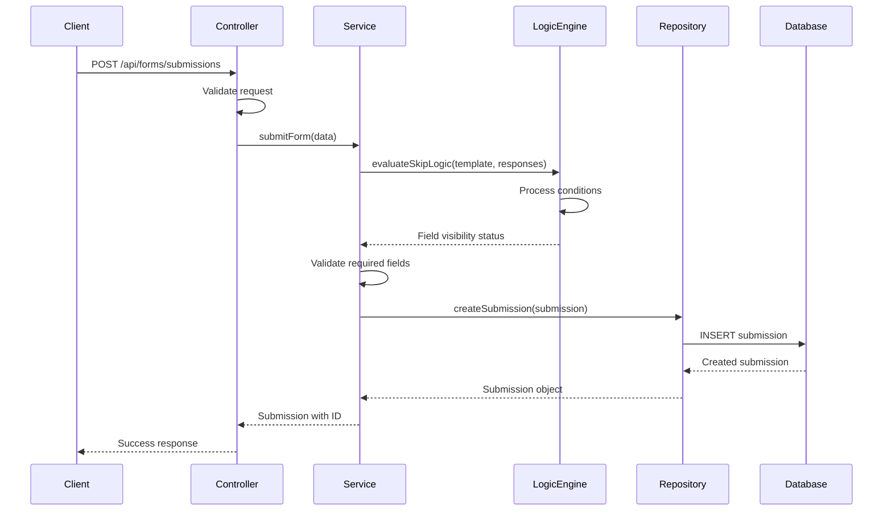
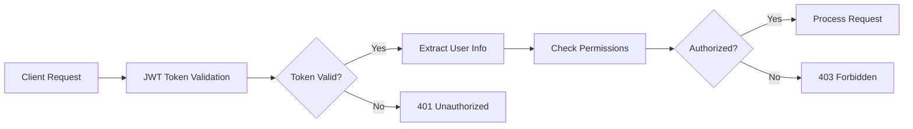
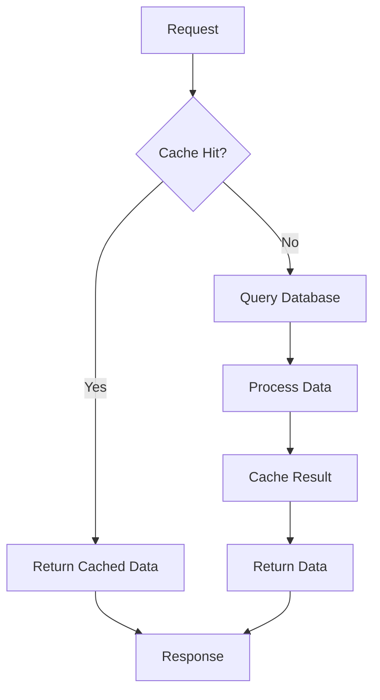

# System Architecture Overview

> Understanding the architecture and design patterns of the Form Service

## Architecture Overview

The Form Service is built as a microservice using Node.js with TypeScript, following clean architecture principles and domain-driven design patterns.



## Core Components

### 1. Application Layer

The application layer handles HTTP requests, validation, and coordinates between the domain and infrastructure layers.

#### Controllers
- **Base Controller**: Common functionality for all controllers
- **Form Template Controller**: Manages form template CRUD operations
- **Form Submission Controller**: Handles form data submission and retrieval
- **Field Logic Controller**: Manages skip logic, validation, and calculations
- **User Controller**: User management operations

#### Validators
- Request validation using Joi or similar libraries
- Input sanitization and type checking
- Business rule validation

#### Middleware
- Authentication and authorization
- Request logging and monitoring
- Error handling and response formatting
- CORS and security headers

### 2. Domain Layer

The domain layer contains the core business logic and domain models.

#### Services
```typescript
// Example service structure
export class FormTemplateService {
  async createTemplate(data: CreateTemplateDto): Promise<FormTemplate> {
    // Business logic for creating templates
  }
  
  async validateTemplate(template: FormTemplate): Promise<ValidationResult> {
    // Template validation logic
  }
}
```

#### Domain Models
- **Form Template**: Core form structure and metadata
- **Form Field**: Individual form fields with types and validation
- **Form Section**: Logical grouping of fields
- **Form Submission**: User-submitted form data
- **Field Logic**: Skip logic, validation rules, and calculations

#### Field Logic Engine
The heart of the system that processes:
- **Skip Logic**: Conditional field visibility
- **Validation Logic**: Field validation rules
- **Calculation Logic**: Computed field values
- **Field Operations**: Mathematical and logical operations

### 3. Infrastructure Layer

Handles external concerns like database access, file storage, and third-party integrations.

#### Database Connector
- Multi-database support (PostgreSQL, MySQL, SQLite)
- Connection pooling and management
- Transaction handling
- Migration management

#### Repository Pattern
```typescript
// Example repository interface
export interface IFormTemplateRepository {
  create(template: FormTemplate): Promise<FormTemplate>;
  findById(id: string): Promise<FormTemplate | null>;
  update(id: string, data: Partial<FormTemplate>): Promise<FormTemplate>;
  delete(id: string): Promise<void>;
  findWithPagination(options: PaginationOptions): Promise<PaginatedResult<FormTemplate>>;
}
```

#### External Services
- File storage (AWS S3, local storage)
- Email services
- Authentication providers
- Monitoring and logging services

## Data Flow

### 1. Form Template Creation



### 2. Form Submission with Skip Logic



## Database Schema

### Core Tables

#### Form Templates
```sql
CREATE TABLE form_templates (
  id UUID PRIMARY KEY DEFAULT gen_random_uuid(),
  name VARCHAR(255) NOT NULL,
  description TEXT,
  version INTEGER DEFAULT 1,
  status VARCHAR(50) DEFAULT 'draft',
  created_by UUID REFERENCES users(id),
  created_at TIMESTAMP DEFAULT CURRENT_TIMESTAMP,
  updated_at TIMESTAMP DEFAULT CURRENT_TIMESTAMP
);
```

#### Form Sections
```sql
CREATE TABLE form_sections (
  id UUID PRIMARY KEY DEFAULT gen_random_uuid(),
  template_id UUID REFERENCES form_templates(id) ON DELETE CASCADE,
  name VARCHAR(255) NOT NULL,
  description TEXT,
  order_index INTEGER NOT NULL,
  created_at TIMESTAMP DEFAULT CURRENT_TIMESTAMP
);
```

#### Form Fields
```sql
CREATE TABLE form_fields (
  id UUID PRIMARY KEY DEFAULT gen_random_uuid(),
  section_id UUID REFERENCES form_sections(id) ON DELETE CASCADE,
  name VARCHAR(255) NOT NULL,
  label VARCHAR(255) NOT NULL,
  type VARCHAR(50) NOT NULL,
  required BOOLEAN DEFAULT false,
  order_index INTEGER NOT NULL,
  validation_rules JSONB,
  options JSONB,
  created_at TIMESTAMP DEFAULT CURRENT_TIMESTAMP
);
```

#### Form Submissions
```sql
CREATE TABLE form_submissions (
  id UUID PRIMARY KEY DEFAULT gen_random_uuid(),
  template_id UUID REFERENCES form_templates(id),
  status VARCHAR(50) DEFAULT 'submitted',
  submitted_at TIMESTAMP DEFAULT CURRENT_TIMESTAMP,
  created_at TIMESTAMP DEFAULT CURRENT_TIMESTAMP
);
```

#### Question Responses
```sql
CREATE TABLE question_responses (
  id UUID PRIMARY KEY DEFAULT gen_random_uuid(),
  submission_id UUID REFERENCES form_submissions(id) ON DELETE CASCADE,
  field_id UUID REFERENCES form_fields(id),
  field_name VARCHAR(255) NOT NULL,
  value TEXT,
  created_at TIMESTAMP DEFAULT CURRENT_TIMESTAMP
);
```

### Field Logic Tables

#### Skip Logic
```sql
CREATE TABLE skip_logic (
  id UUID PRIMARY KEY DEFAULT gen_random_uuid(),
  field_id UUID REFERENCES form_fields(id) ON DELETE CASCADE,
  condition JSONB NOT NULL,
  action VARCHAR(50) NOT NULL,
  description TEXT,
  created_at TIMESTAMP DEFAULT CURRENT_TIMESTAMP
);
```

#### Validation Logic
```sql
CREATE TABLE validation_logic (
  id UUID PRIMARY KEY DEFAULT gen_random_uuid(),
  field_id UUID REFERENCES form_fields(id) ON DELETE CASCADE,
  rule_type VARCHAR(50) NOT NULL,
  rule_config JSONB NOT NULL,
  error_message TEXT,
  created_at TIMESTAMP DEFAULT CURRENT_TIMESTAMP
);
```

#### Calculation Logic
```sql
CREATE TABLE calculation_logic (
  id UUID PRIMARY KEY DEFAULT gen_random_uuid(),
  field_id UUID REFERENCES form_fields(id) ON DELETE CASCADE,
  formula TEXT NOT NULL,
  dependencies JSONB,
  created_at TIMESTAMP DEFAULT CURRENT_TIMESTAMP
);
```

## Security Architecture

### Authentication & Authorization



### Security Measures

1. **JWT Authentication**: Stateless token-based authentication
2. **Role-Based Access Control**: User roles and permissions
3. **Input Validation**: Comprehensive request validation
4. **SQL Injection Prevention**: Parameterized queries
5. **XSS Protection**: Input sanitization and output encoding
6. **Rate Limiting**: API rate limiting to prevent abuse
7. **CORS Configuration**: Cross-origin resource sharing
8. **HTTPS Enforcement**: Secure communication

## Performance Considerations

### Caching Strategy



### Database Optimization

1. **Indexing**: Strategic indexes on frequently queried columns
2. **Connection Pooling**: Efficient database connection management
3. **Query Optimization**: Optimized SQL queries and joins
4. **Pagination**: Efficient pagination for large datasets
5. **Read Replicas**: Database read replicas for scaling

### Application Performance

1. **Async/Await**: Non-blocking I/O operations
2. **Request Batching**: Batch multiple operations
3. **Lazy Loading**: Load data on demand
4. **Compression**: Response compression
5. **CDN Integration**: Static asset delivery

## Monitoring & Observability

### Logging Strategy

```typescript
// Structured logging example
logger.info('Form template created', {
  templateId: template.id,
  userId: user.id,
  templateName: template.name,
  timestamp: new Date().toISOString()
});
```

### Metrics Collection

- **Request/Response Times**: API performance metrics
- **Error Rates**: Error tracking and alerting
- **Database Performance**: Query execution times
- **Resource Usage**: CPU, memory, and disk usage
- **Business Metrics**: Form submissions, user activity

### Health Checks

```typescript
// Health check endpoint
app.get('/health', async (req, res) => {
  const health = {
    status: 'ok',
    timestamp: new Date().toISOString(),
    version: process.env.npm_package_version,
    database: await checkDatabaseConnection(),
    redis: await checkRedisConnection()
  };
  
  res.json(health);
});
```

## Deployment Architecture

### Container Deployment

```yaml
# Docker Compose example
version: '3.8'
services:
  form-service:
    build: .
    ports:
      - "3000:3000"
    environment:
      - NODE_ENV=production
      - DB_HOST=postgres
      - DB_PORT=5432
    depends_on:
      - postgres
      - redis
  
  postgres:
    image: postgres:14
    environment:
      - POSTGRES_DB=form_service
      - POSTGRES_USER=postgres
      - POSTGRES_PASSWORD=password
    volumes:
      - postgres_data:/var/lib/postgresql/data
  
  redis:
    image: redis:7-alpine
    ports:
      - "6379:6379"
```

### Kubernetes Deployment

```yaml
# Kubernetes deployment example
apiVersion: apps/v1
kind: Deployment
metadata:
  name: form-service
spec:
  replicas: 3
  selector:
    matchLabels:
      app: form-service
  template:
    metadata:
      labels:
        app: form-service
    spec:
      containers:
      - name: form-service
        image: your-org/form-service:latest
        ports:
        - containerPort: 3000
        env:
        - name: NODE_ENV
          value: "production"
        - name: DB_HOST
          valueFrom:
            configMapKeyRef:
              name: form-service-config
              key: db_host
```

## Scalability Considerations

### Horizontal Scaling

1. **Stateless Design**: No session state stored in application
2. **Load Balancing**: Multiple instances behind load balancer
3. **Database Scaling**: Read replicas and connection pooling
4. **Caching**: Redis for session and data caching

### Vertical Scaling

1. **Resource Optimization**: Efficient memory and CPU usage
2. **Connection Management**: Proper connection pooling
3. **Garbage Collection**: Optimized Node.js GC settings
4. **Memory Management**: Proper memory allocation and cleanup

## Future Enhancements

### Planned Features

1. **Real-time Collaboration**: WebSocket support for collaborative form editing
2. **Advanced Analytics**: Form analytics and insights
3. **Multi-language Support**: Internationalization (i18n)
4. **API Versioning**: Proper API versioning strategy
5. **GraphQL Support**: GraphQL API alongside REST
6. **Event Sourcing**: Event-driven architecture for audit trails

### Technical Improvements

1. **Microservices Split**: Break down into smaller microservices
2. **Event Streaming**: Apache Kafka for event processing
3. **Machine Learning**: AI-powered form optimization
4. **Blockchain Integration**: Immutable form submissions
5. **Edge Computing**: CDN-based form processing

## Conclusion

The Form Service architecture is designed for scalability, maintainability, and performance. The clean separation of concerns, domain-driven design, and comprehensive testing ensure a robust and extensible system that can handle complex form requirements while maintaining high performance and reliability.

For more detailed information about specific components, see:
- [Database Schema](database-schema.md) - Detailed database design
- [Domain Models](domain-models.md) - Core business entities
- [Service Architecture](service-architecture.md) - Service layer design 