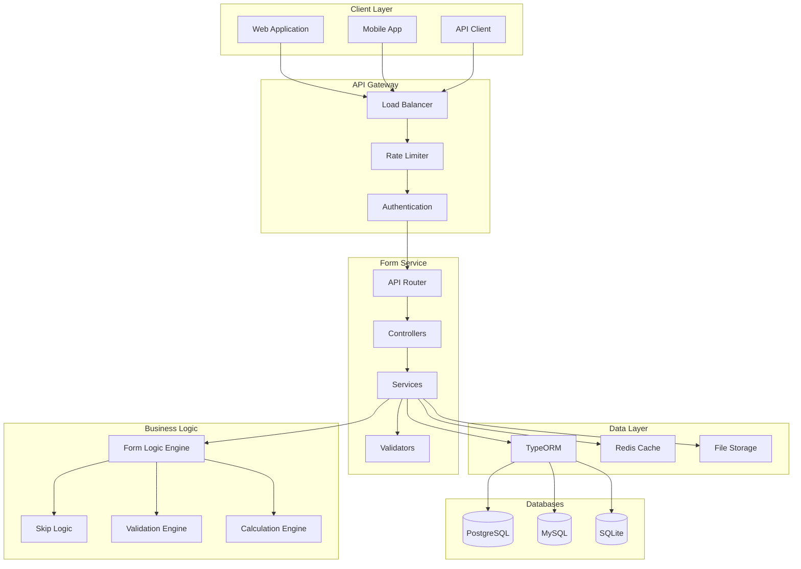
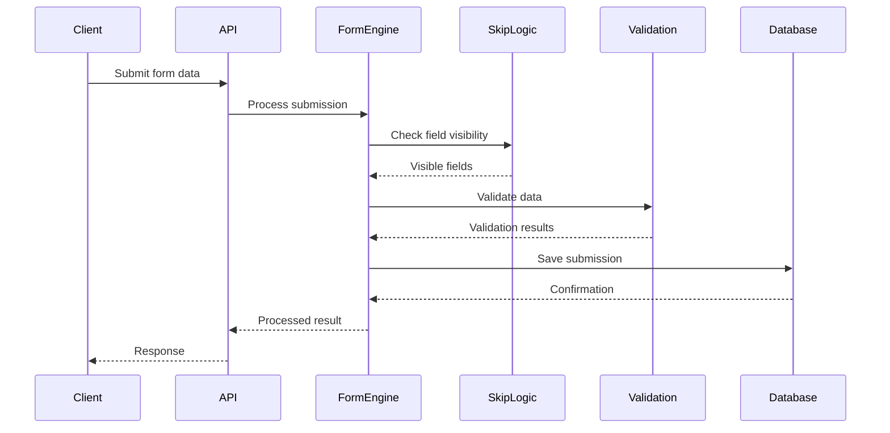
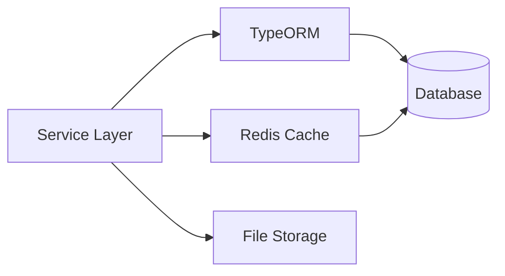
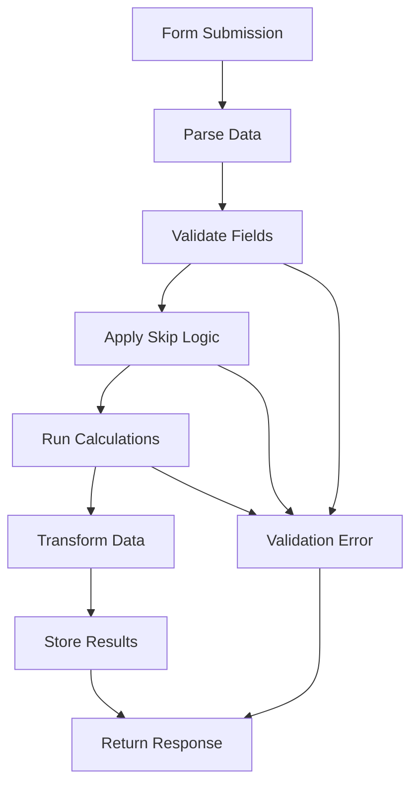
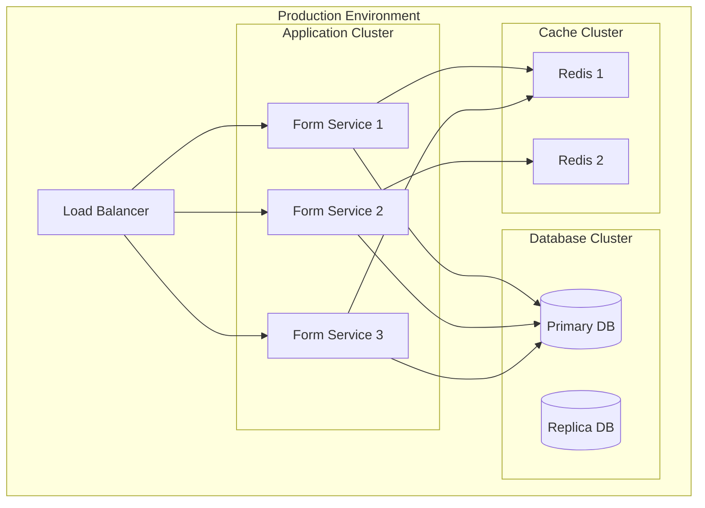

# System Overview

> Comprehensive overview of the Form Service architecture and components

## What is Form Service?

Form Service is a powerful, scalable Node.js microservice designed for creating, managing, and processing dynamic forms with advanced logic capabilities. It provides a complete solution for building complex form-based applications with features like skip logic, validation rules, calculations, and real-time processing.

## Key Features

### 🎯 Core Capabilities
- **Dynamic Form Building**: Create complex forms with nested sections and conditional fields
- **Advanced Field Logic**: Skip logic, validation rules, and calculation formulas
- **Real-time Processing**: Instant validation and dynamic field updates
- **Multi-format Support**: JSON, CSV, and PDF export capabilities
- **Role-based Access**: Granular permissions and user management
- **API-First Design**: RESTful API with comprehensive documentation

### 🔧 Technical Features
- **Microservice Architecture**: Scalable, containerized deployment
- **Multi-database Support**: PostgreSQL, MySQL, SQLite
- **TypeScript**: Full type safety and modern development experience
- **JWT Authentication**: Secure token-based authentication
- **Rate Limiting**: API protection and abuse prevention
- **Comprehensive Logging**: Structured logging with multiple levels

## System Architecture



## Component Overview

### 1. API Layer

The API layer handles HTTP requests and responses, providing a RESTful interface for all form operations.

**Key Components:**
- **Routers**: Route requests to appropriate controllers
- **Controllers**: Handle HTTP requests and responses
- **Validators**: Validate request data and parameters
- **Middleware**: Authentication, logging, error handling

**Example API Structure:**
```
/api
├── /auth          # Authentication endpoints
├── /forms         # Form management
│   ├── /templates # Form templates
│   ├── /fields    # Form fields
│   └── /sections  # Form sections
├── /submissions   # Form submissions
├── /users         # User management
└── /health        # Health checks
```

### 2. Business Logic Layer

The business logic layer contains the core form processing engine and logic handlers.

**Key Components:**
- **Form Logic Engine**: Processes form templates and submissions
- **Skip Logic Engine**: Handles conditional field visibility
- **Validation Engine**: Validates form data and rules
- **Calculation Engine**: Processes mathematical and logical operations

**Logic Processing Flow:**


### 3. Data Layer

The data layer manages data persistence, caching, and file storage.

**Key Components:**
- **TypeORM**: Object-relational mapping
- **Redis**: Caching and session storage
- **File Storage**: Document and file management
- **Database Connectors**: Multi-database support

**Data Flow:**


## Form Processing Engine

### Form Template Structure

Forms are built using a hierarchical structure:

```
Form Template
├── Sections
│   ├── Fields
│   │   ├── Basic Properties (name, type, label)
│   │   ├── Validation Rules
│   │   ├── Skip Logic
│   │   └── Calculation Logic
│   └── Section Logic
└── Template Logic
```

### Field Types and Logic

**Supported Field Types:**
- **Text Fields**: Single line, multi-line, email, phone
- **Numeric Fields**: Numbers, dates, times
- **Selection Fields**: Dropdowns, radio buttons, checkboxes
- **File Fields**: Document uploads, images
- **Special Fields**: Hidden, calculated, conditional

**Logic Capabilities:**
- **Skip Logic**: Show/hide fields based on conditions
- **Validation Logic**: Custom validation rules
- **Calculation Logic**: Mathematical and logical operations
- **Composition Logic**: Combine multiple field values

### Processing Pipeline



## Security Architecture

### Authentication & Authorization

**JWT-based Authentication:**
- Access tokens for API requests
- Refresh tokens for session management
- Token rotation and expiration

**Role-based Access Control:**
- User roles (admin, manager, user, viewer)
- Granular permissions (resource:action)
- API key authentication for services

**Security Measures:**
- Password hashing with bcrypt
- Rate limiting on all endpoints
- Input validation and sanitization
- CORS configuration
- HTTPS enforcement

### Data Protection

**Encryption:**
- Sensitive data encryption at rest
- TLS encryption in transit
- API key encryption

**Access Control:**
- Row-level security
- Field-level permissions
- Audit logging

## Performance & Scalability

### Caching Strategy

**Multi-level Caching:**
- **Application Cache**: In-memory caching
- **Redis Cache**: Distributed caching
- **Database Cache**: Query result caching

**Cache Invalidation:**
- Time-based expiration
- Event-driven invalidation
- Manual cache clearing

### Database Optimization

**Indexing Strategy:**
- Primary key indexes
- Foreign key indexes
- Composite indexes for queries
- Full-text search indexes

**Query Optimization:**
- Connection pooling
- Query result caching
- Prepared statements
- Query analysis and tuning

### Horizontal Scaling

**Load Balancing:**
- Round-robin load balancing
- Health check monitoring
- Auto-scaling capabilities

**Microservice Design:**
- Stateless service design
- Container-based deployment
- Service discovery
- Circuit breaker patterns

## Monitoring & Observability

### Logging

**Structured Logging:**
- JSON format logs
- Multiple log levels
- Request/response logging
- Error tracking

**Log Aggregation:**
- Centralized log collection
- Log analysis and alerting
- Performance monitoring

### Metrics

**Application Metrics:**
- Request/response times
- Error rates
- Throughput metrics
- Resource utilization

**Business Metrics:**
- Form submission rates
- User activity metrics
- Feature usage statistics

### Health Checks

**System Health:**
- Database connectivity
- External service status
- Resource availability
- Performance indicators

## Deployment Architecture

### Container Deployment



### Environment Configuration

**Development Environment:**
- Local database (SQLite)
- In-memory caching
- Debug logging
- Hot reloading

**Staging Environment:**
- Shared database
- Redis caching
- Production-like configuration
- Integration testing

**Production Environment:**
- High-availability database
- Distributed caching
- Performance monitoring
- Automated scaling

## Integration Capabilities

### API Integration

**RESTful API:**
- Standard HTTP methods
- JSON request/response format
- Comprehensive error handling
- API versioning

**Webhook Support:**
- Event-driven notifications
- Custom webhook endpoints
- Retry mechanisms
- Security validation

### Third-party Integrations

**Authentication Providers:**
- Google OAuth
- Microsoft Azure AD
- SAML 2.0
- Custom OAuth providers

**Storage Providers:**
- AWS S3
- Google Cloud Storage
- Azure Blob Storage
- Local file system

**Communication Services:**
- Email providers (SendGrid, AWS SES)
- SMS services (Twilio)
- Push notifications

## Development Workflow

### Code Organization

```
src/
├── api/              # API layer
│   ├── controllers/  # Request handlers
│   ├── routers/      # Route definitions
│   └── validators/   # Input validation
├── services/         # Business logic
├── database/         # Data access layer
├── common/           # Shared utilities
└── config/           # Configuration
```

### Testing Strategy

**Unit Testing:**
- Service layer testing
- Utility function testing
- Mock database interactions

**Integration Testing:**
- API endpoint testing
- Database integration
- External service testing

**End-to-End Testing:**
- Complete workflow testing
- User scenario testing
- Performance testing

## Future Roadmap

### Planned Features

**Advanced Logic:**
- Workflow automation
- Decision trees
- Machine learning integration
- Advanced calculations

**Enhanced UI:**
- Visual form builder
- Drag-and-drop interface
- Real-time preview
- Mobile optimization

**Enterprise Features:**
- Multi-tenancy
- Advanced analytics
- Custom branding
- White-label solutions

### Technology Evolution

**Performance Improvements:**
- GraphQL API
- Real-time subscriptions
- Edge computing
- CDN integration

**Scalability Enhancements:**
- Microservice decomposition
- Event-driven architecture
- Message queues
- Distributed caching

## Getting Started

### Quick Start

1. **Install Dependencies:**
   ```bash
   npm install
   ```

2. **Configure Environment:**
   ```bash
   cp .env.example .env
   # Edit .env with your configuration
   ```

3. **Start Development Server:**
   ```bash
   npm run dev
   ```

4. **Access Documentation:**
   ```
   http://localhost:3000/api/docs
   ```

### Next Steps

- 📖 [Installation Guide](about/installation.md) - Complete setup instructions
- 🔧 [Configuration Guide](about/configuration.md) - System configuration
- 📚 [API Reference](api/overview.md) - API documentation
- 🗄️ [Database Schema](schema/database-schema.md) - Database design
- 🚀 [Deployment Guide](guides/deployment.md) - Production deployment 